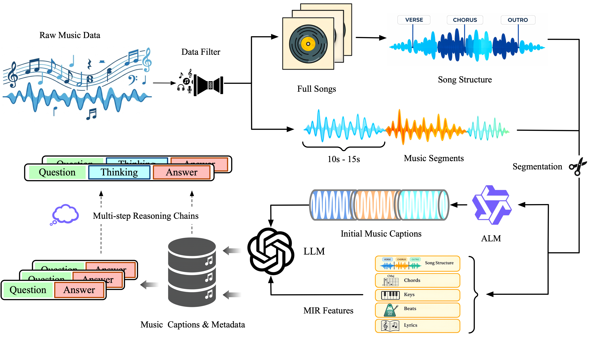

# MOSS-Music-Data-Pipeline

<p align="center">
  
</p>


<p align="center">
  <a href="./README.md">English</a> | <a href="./README_zh.md">简体中文</a>
</p>

MOSS-Music-Data-Pipeline 是用于大规模音乐数据标注与处理的流水线，用于构建
包括 [`MOSS-Music`](https://github.com/OpenMOSS/MOSS-Music) 训练数据在内的
音乐理解语料。

这个仓库可以把原始音乐文件逐步处理为结构化的、chat 格式的训练数据，服务于
音乐理解模型的数据构建与扩展生产。

## 目录

- [概览](#概览)
- [亮点](#亮点)
- [流程总览](#流程总览)
- [快速开始](#快速开始)
- [运行方式](#运行方式)
- [目录结构](#目录结构)
- [数据产物](#数据产物)
- [说明](#说明)

## 概览

这个仓库覆盖从原始音乐文件到 chat 格式训练样本的端到端流程，主要包括：

- 音频时长检测；
- MIR 特征抽取（和弦、节拍、调式、旋律、乐器等）；
- 歌曲结构切分；
- 歌词 ASR；
- 元数据合并与清洗；
- 面向训练数据的 caption / query 生成。

多模态推理阶段面向任意 OpenAI 兼容端点，典型选择包括
**Qwen3-Omni 系列**、**MusicFlamingo / Audio-Flamingo-3** 等音频 / 音乐 ALM，
以及用于后续生成的指令 LLM。脚本本身不绑定具体模型，只需在运行脚本中填入
对应服务地址即可。

## 亮点

- **端到端数据流水线**：从原始音频直接生成 chat 格式训练样本。
- **后端可插拔**：ALM Caption、歌词 ASR 和 Step 5 的 LLM 生成均支持
  OpenAI 兼容接口。
- **流程并行友好**：整曲分析、结构标注、分段处理等阶段可并行执行。
- **便于规模化扩展**：支持 `JSONL` 分片，可运行在自有 HPC、Kubernetes
  或 Ray 集群上。

## 流程总览

<p align="center">
  
</p>

### 详细执行流程

```text
原始音频目录
     │
     ▼
┌─────────────────────────────────────────────────────────────────────┐
│ Step 0: calc_duration.py                                            │
│   扫描音频/视频文件 -> {"audio_path", "duration"}                   │
│   输出: data.jsonl                                                  │
└─────────────────────────────────────────────────────────────────────┘
     │
     ▼  --- 以下 3 个步骤可以并行执行 ---
     │
     ├──> Step 1a: alm_caption_infer.py -> data.alm
     │      通过 ALM / MusicFlamingo / Qwen3-Omni 生成基础 caption（API）
     │
     ├──> Step 1b: MusicToolsPipeline (Ray，本地 CPU/GPU)
     │      全曲 MIR: Chordino + BeatNet + Essentia
     │      CPU -> data.music-cpu/results.jsonl
     │      GPU -> data.music-gpu/results.jsonl
     │
     └──> Step 1c: SongFormer/ (本地 GPU)
            歌曲结构标注
     │
     ▼
┌─────────────────────────────────────────────────────────────────────┐
│ Step 2: song_cut.py                                                 │
│   根据 SongFormer 结构切分音频                                      │
│   输出: data.sf_cut.jsonl + audio_seg/                              │
└─────────────────────────────────────────────────────────────────────┘
     │
     ▼  --- 以下 2 个步骤可以并行执行 ---
     │
     ├──> Step 3a: asr_infer.py -> 歌词 ASR（API）
     │
     └──> Step 3b: MusicToolsPipeline (Ray，本地 CPU)
            分段级调式分析
     │
     ▼
┌─────────────────────────────────────────────────────────────────────┐
│ Step 4: 合并与清洗                                                  │
│   4a key_asr_merge -> 4b metadata_merge                             │
│   -> 4c asr_cleanup -> 4d organize_metadata                         │
└─────────────────────────────────────────────────────────────────────┘
     │
     ▼
┌─────────────────────────────────────────────────────────────────────┐
│ Step 5: 生成训练数据（API）                                         │
│   5a caption_generate -> 5b query_generate                          │
│   输出: data.captions.chat.jsonl                                    │
└─────────────────────────────────────────────────────────────────────┘
```

## 快速开始

```bash
# 1. 安装依赖并下载 SongFormer / MusicFM 权重
bash setup.sh

# 2. 复制并修改本地运行脚本
cp examples/run_pipeline_local.sh my_run.sh
vim my_run.sh   # 修改 DATA_ROOT、WORK_DIR、API URLs
bash my_run.sh
```

## 运行方式

### 本地模式

推荐入口脚本：`examples/run_pipeline_local.sh`

所有任务默认在本机执行。`MusicToolsPipeline` 通过 Ray 在本地 CPU / GPU 上运行，
`SongFormer` 在本地 GPU 上运行；ALM Caption、歌词 ASR 和最终 caption / query
生成依赖外部已部署的推理服务。

典型情况下需要准备三个 OpenAI 兼容端点：

- **ALM Caption**：例如 Qwen3-Omni、MusicFlamingo、Audio-Flamingo-3；
- **歌词 ASR**：例如 Qwen3-Omni 服务；
- **指令 LLM**：用于 Step 5 的 caption / query 生成。

示例：

```bash
vllm serve Qwen3-Omni-30B-A3B-Instruct --port 10008
vllm serve Qwen3-Omni-30B-A3B-Instruct --port 8000
vllm serve Qwen3-235B-A22B-Instruct-2507 -tp 8 --port 8001
```

## 目录结构

```text
MOSS-Music-Data-Pipeline/
├── README.md
├── README_zh.md
├── setup.sh
├── requirements.txt
├── patch_beatnet.py
├── .env.example
├── scripts/
│   ├── calc_duration.py
│   ├── alm_caption_infer.py
│   ├── song_cut.py
│   ├── asr_infer.py
│   ├── key_asr_merge.py
│   ├── metadata_merge.py
│   ├── asr_cleanup.py
│   ├── organize_metadata.py
│   ├── caption_generate.py
│   ├── query_generate.py
│   ├── shard_jsonl.py
│   └── merge_sharded_results.py
├── examples/
│   ├── run_pipeline_local.sh
│   ├── launch_qwen3_asr_local.sh
│   └── run_asr_parallel.sh
├── MusicToolsPipeline/
└── SongFormer/
```

## 数据产物

| 阶段 | 输出文件 | 说明 |
|---|---|---|
| Step 0 | `data.jsonl` | 原始音频路径与时长 |
| Step 1a | `data.alm` | ALM 生成的基础 caption |
| Step 1b | `data.music-cpu/results.jsonl` | 全曲 MIR 特征 |
| Step 1b | `data.music-gpu/results.jsonl` | 乐器相关特征 |
| Step 1c | `data.sf.jsonl` | SongFormer 结构标注 |
| Step 2 | `data.sf_cut.jsonl` | 切分后的音频片段及元信息 |
| Step 3a | `data.sf_cut.asr/*.jsonl` | 片段级歌词 ASR 结果 |
| Step 3b | `data.sf_cut.music-cpu/results.jsonl` | 片段级调式 / 和弦分析 |
| Step 4 | `data.meta.clean.organized.jsonl` | 合并清洗后的统一元数据 |
| Step 5 | `data.captions.chat.jsonl` | 最终 chat 格式训练样本 |

## 说明

- `examples/run_pipeline_local.sh` 是推荐的完整入口脚本。
- `scripts/alm_caption_infer.py` 实现 Step 1a 的 ALM Base Caption 推理，
  支持任意 OpenAI 兼容的音频语言模型端点。
- 原先位于 `MOSS-Music/data_pipeline/` 的实现已迁移到当前仓库。
- 大规模语料建议先用 `scripts/shard_jsonl.py` 对输入进行分片，再按分片在
  自己的 HPC / k8s / Ray 集群上并行运行，最后用
  `scripts/merge_sharded_results.py` 合并结果。
